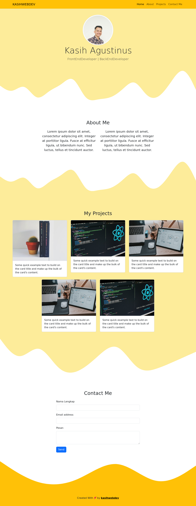

# Simple-Portfolio-Bootstrap5

# Bootstrap 5 Portfolio



This repository contains my personal portfolio website built using Bootstrap 5. The project aims to showcase my skills and recent work as a Front-End Developer and Back-End Developer.

## Features

- Home page with an attractive jumbotron.
- "About Me" section to talk about myself.
- Project gallery with brief descriptions.
- "Contact Me" form for reaching out to me.
- Footer displaying information about me.

## Usage

1. Clone this repository:

   ```bash
   git clone https://github.com/username/repo.git
   ```

2. Open the `index.html` file to view the website locally.

## Technologies

- HTML5
- CSS3
- Bootstrap 5
- [Bootstrap Icons](https://icons.getbootstrap.com/)

## Contributions

I do not accept contributions to this project as it is my personal portfolio. However, you can use this project as a reference or inspiration to create your own portfolio.

## License

This project is licensed under the [MIT License](LICENSE).
```

`https://github.com/kasihwebdev/repo.git`
